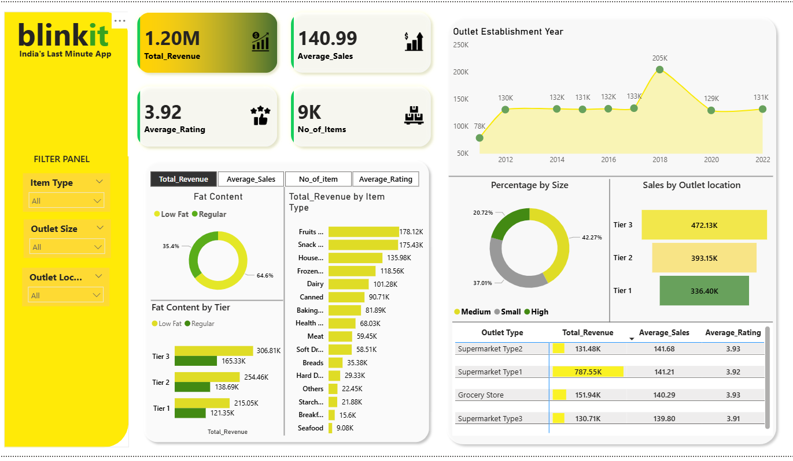

# Blinkit Sales Dashboard – Power BI

This project is a Power BI interactive dashboard created to analyze Blinkit’s sales performance.  
It includes key insights such as:

- 📊 Total Revenue  
- ⭐ Average Rating  
- 🏪 Outlet Analysis  
- 🍎 Item Type Performance  
- 🔄 Fat Content Comparison  
- 🏙 Outlet Location & Size Wise Revenue  
- 📈 Yearly Sales Trend
- 
## 📁 Files in this Repository

| File | Description |
|------|-------------|
| `blinkit sales dashboard project.pbit` | Power BI template of the dashboard |
| `image.png` | Screenshot of the final dashboard |
| `README.md` | Documentation for the project |

## 📸 Dashboard Preview

## 🚀 Tools Used
- Microsoft Power BI  
- DAX  
- Data Cleaning  
- Data Modelling  

## 🙌 About the Project  
This dashboard helps understand customer behavior, revenue trends, outlet performance, and product segments — useful for both business insights and portfolio projects.

## 📬 Contact  
**Ritesh Chaurasiya**  
If you like this project, don’t forget to ⭐ star the repository!
